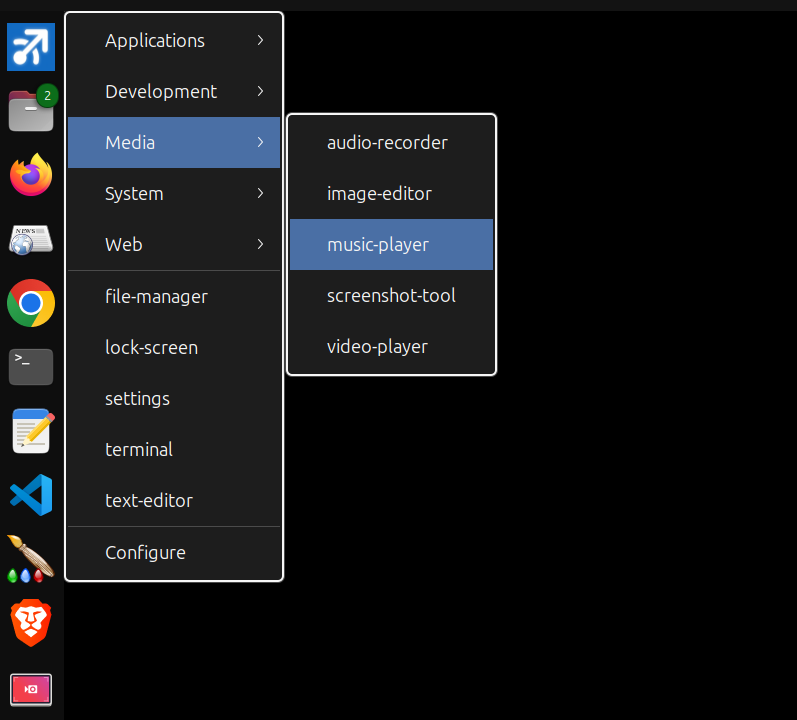

# Linux Start Menu

[](start-menu.py)
[](start-menu.py)
[](README.md#requirements)
[](start-menu.py)
[](start-menu.py)
[](LICENSE.md)

A lightweight GTK-based Windows-like start menu for Linux that launches shell scripts from a customizable folder structure. In the screenshot below you see start menu icon in the upper left corner, and it's been clicked to open and display the menu.

The screenshot below shows only an example of what the menu could look like, which is based on the content of the example `scripts` folder in the project root. to build your own menu you'll create your own scripts folder, and it will look completely different from the screenshot below, because you'll have your own menu items defined, based on the file names and folder names in your own Scripts folder. 



## Overview

This project provides a native popup menu that appears at your cursor position, built dynamically from the contents of the `scripts/` folder. Simply organize your scripts into folders, and the menu structure mirrors your file system hierarchy. The `scripts` folder in this project is just for testing and demonstration purposes; so when you run the `install.sh` you can specify the location of your own menu folder.

## Requirements

- Python 3
- GTK 3 (via PyGObject)
- `gnome-terminal` (for scripts that require a visible terminal)

Install dependencies on Debian/Ubuntu:
```bash
sudo apt install python3-gi gir1.2-gtk-3.0 gnome-terminal
```

## Usage

Run the menu:
```bash
./start-menu.py
```

Optionally, specify a different scripts folder:
```bash
./start-menu.py myfolder
```

The folder name is relative to the script's location. If no argument is provided, it defaults to `scripts/`.

The menu will pop up at your current mouse position. Click a script to run it, or click outside / press Escape to dismiss.

## Defining the Menu Structure

The menu is built entirely from the `scripts/` folder. **Your folder structure becomes your menu structure:** To see this work, simply put some bash script files in the 'scripts' folder (or any subfolders onder 'scripts' to see it working)

### Rules:
- **Folders** become submenus
- **Only `.sh` and `.txt` files** are recognized (other files are ignored)
- **File extensions** (`.sh`, `.txt`) are hidden in the menu display
- **Leading underscores** in filenames are stripped from the display name (useful for ordering)
- **Hidden files** (starting with `.`) are ignored
- Folders appear first, followed by a separator, then files (both sorted alphabetically)

## Supported File Types

Start Menu supports two types of files, each handled differently:

### Shell Scripts (`.sh`)
Shell scripts are executed as scripts. If a `.sh` file is not marked executable, it will be run with `bash`. Use shell scripts when you need:
- Multi-step operations
- Conditional logic or loops
- Interactive terminal sessions (with `Terminal=true`)

### Command Files (`.txt`)
Text files are treated as simple command launchers. The entire content of the file is read, newlines are replaced with spaces, and the result is executed as a single shell command. These always run **silently in the background** (no terminal window).

**Example:** Create `scripts/firefox.txt` containing:
```
firefox
```

**Multi-line commands:** You can split long commands across multiple lines for readability:
```
firefox
--new-window
https://github.com
```
This becomes: `firefox --new-window https://github.com`

**Use cases for `.txt` files:**
- Launching GUI applications (e.g., `firefox`, `gimp`, `code`)
- Running simple one-liner commands
- Creating quick shortcuts to applications with specific arguments

### File Links (Shortcuts)
Symbolic links are fully supported. Create symlinks to scripts located elsewhere on your system:
```bash
ln -s /path/to/your/script.sh scripts/My\ Script.sh
```

This allows you to include scripts without moving them from their original location.

## Terminal=true Feature

By default, scripts run silently in the background with no visible output. If you need to see the output or interact with a script, add the following comment anywhere in the **first 10 lines** of your script:

```bash
#!/bin/bash
# Terminal=true

echo "This will be visible in a terminal window!"
read -p "Press Enter to continue..."
```

When `Terminal=true` is detected (case-insensitive, spaces ignored), the script will launch in a new `gnome-terminal` window that stays open after the script completes.

**Working Directory:** When running in a terminal, the working directory is automatically set to the folder containing the script. If the script is a symbolic link, the working directory will be the folder containing the actual target file, not the link itself.

**Use cases:**
- Scripts that require user input
- Scripts with important output to review
- Interactive tools and utilities

## Install for GNOME/Ubuntu

For GNOME/Ubuntu users, you can automatically install Start Menu to your dock with a single command:

```bash
./install.sh
```

This will:
- Create a `.desktop` file with the correct paths
- Add Start Menu to your dock for single-click launching
- Set up the custom icon

To remove Start Menu from the dock and applications menu:

```bash
./uninstall.sh
```

Note: The uninstall script only removes the desktop integration—your source files remain intact.

## Tips

- **Quick access**: Bind `start-menu.py` to a keyboard shortcut or mouse gesture for instant access
- **Organization**: Use folders to group related scripts (e.g., "Development", "System", "Media")
- **Naming**: Use descriptive filenames since they become menu labels


