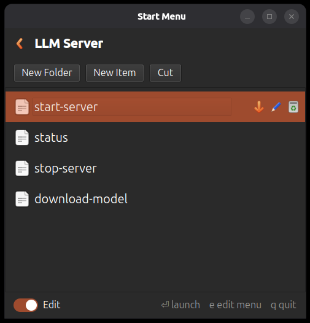

# Start Menu

A keyboard-driven menu for launching scripts. The entire menu lives in one YAML file, and the whole interaction is four keys: **↑↓** to move, **→** to open a section, **←** to go back, **⏎** to launch. One level is shown at a time — going into a section replaces the list rather than expanding it — so the menu stays the same size no matter how deep it gets. The mouse is never required.

## Learn how to use with the [User Guide](docs/USER_GUIDE.md)



## Running

```bash
./start.sh                      # uses ~/.config/start-menu/menu.yaml
./start.sh /path/to/menu.yaml   # or exactly the file you name
```

The menu file's path is optional. With no argument Start Menu uses `~/.config/start-menu/menu.yaml`; given one, it reads (and writes, when you edit through the GUI) exactly the file you point it at. Either way, if the file doesn't exist yet it's created as a copy of the [example menu](#example-menu) below, so a first run just works.

`start.sh` runs the app through [uv](https://docs.astral.sh/uv/), which creates and refreshes the virtualenv from `pyproject.toml` on every run — there is no install step and nothing to activate.

### The `windowchrome` sibling project

Start Menu's wide scroll bars, enlarged radio buttons and **Edit** toggle switch come from **[windowchrome](https://github.com/Clay-Ferguson/windowchrome)**, a small reusable PyQt6 library kept in its own repository so several apps can share the same look. It is **not on PyPI**: `pyproject.toml` resolves it by path, from a directory sitting *beside* this one.

```bash
cd ..                      # the directory holding start-menu/
git clone https://github.com/Clay-Ferguson/windowchrome.git
```

giving:

```
projects/
├── start-menu/
└── windowchrome/          <- must be a sibling, and named this
```

If it is missing, `./start.sh` and `./lint.sh` fail immediately with an unresolved path dependency rather than with anything subtle. The checkout is used in place — `uv` installs it editable, so there is nothing to build and an edit there is live here on the next run.

## Installing

```bash
packaging/build-deb.sh
sudo apt install ./dist/start-menu_0.1.0_all.deb
```

`packaging/build-deb.sh` (runnable from anywhere) builds `dist/start-menu_<version>_all.deb`, which any Debian-based distribution can install if its repositories carry `python3-pyqt6` and Python 3.11 or newer. It installs:

| Path | What it is |
|---|---|
| `/usr/bin/start-menu` | The launcher. |
| `/usr/lib/start-menu/` | The `start_menu` package (with its `data/`: the example menu and the window icon) and a copy of `windowchrome`. |
| `/usr/share/applications/start-menu.desktop` | The application-menu entry. |
| `/usr/share/icons/hicolor/*/apps/start-menu.png` | The icon, at every size from 16 to 128 px. |

The desktop entry names no menu file, because one entry serves every user on the machine: each gets their own `~/.config/start-menu/menu.yaml`, copied from the example the first time they run it. Running `start-menu /path/to/other.yaml` from a terminal still overrides that.

PyQt6 and PyYAML aren't bundled. The package depends on the distribution's own `python3-pyqt6` and `python3-yaml`, which `apt` installs along with it, and `uv` isn't needed at all. A terminal emulator (for the `terminal` and `hold` launch modes) and `tmux` (for `tmux` mode) are only recommended and suggested, not required — each mode explains itself in a dialog if what it needs is missing.

Building needs only `dpkg-deb`, which every Debian system has, and the `windowchrome` sibling checkout described above, whose source is copied into the package. The version comes from `pyproject.toml`. Before packing, the script smoke-tests what it staged — every import resolves, the example menu loads without errors, the modules import — so a file left out fails the build rather than the first launch. The package's Maintainer field comes from your `git config user.name` and `user.email`; override it with `START_MENU_MAINTAINER="Name <email>"`.

When installing from inside your home folder, `apt` may end with this notice:

```
N: Download is performed unsandboxed as root as file '.../start-menu_0.1.0_all.deb' couldn't be accessed by user '_apt'. - pkgAcquire::Run (13: Permission denied)
```

It's harmless, and the package still installs normally. `apt` usually reads package files as its unprivileged `_apt` user, and Ubuntu home folders are private by default, so `apt` read the file as root instead. To avoid the notice, copy the `.deb` somewhere world-readable first, such as `/tmp`, and install it from there.

Remove the package with `sudo apt remove start-menu`. Your `~/.config/start-menu` is untouched.

The package is the only way to install Start Menu. To run it from this checkout instead — while working on it, say — use `./start.sh` directly; there is nothing to install for that.

## Example menu

`start_menu/data/example-menu.yaml`, checked into the repo, is a ready-to-run example rather than anyone's real menu — every entry only uses applications and commands that ship on a standard Ubuntu Desktop install, so it runs as-is. Start Menu writes to the file it's given when you edit through the GUI, so try it on a copy:

```bash
cp start_menu/data/example-menu.yaml /tmp/example.yaml
./start.sh /tmp/example.yaml
```

It's meant to be read as much as run: an "Applications" section of `file:` items (`launch: detached`) launching Firefox, Files, Terminal and Calculator, and a "Shell Script Examples" section of `sh:` snippets (`launch: hold`) that print system and network info, plus an `options.editor` setting. Turn on **Edit** (or press `e` to open the file itself) to see how each piece maps to the reference below, then start replacing the entries with your own. It is also what seeds a new `~/.config/start-menu/menu.yaml`, so a first run drops you straight into it — and since no menu is read from any fixed location, you can equally point `start.sh` at a copy anywhere you like.

## Keys

| Key | Action |
|---|---|
| `↑` `↓` | Move the highlight within the current level |
| `→` | Open the highlighted section (no-op on a script) |
| `←` | Back up one level, landing the highlight on the section you came out of |
| `⏎` | Launch the highlighted script, or open the highlighted section |
| `e` | Open the menu file itself in your editor |
| `Esc` / `q` | Quit |

The mouse works too: double-click a row to launch or open it, and click the back arrow in the header to go up a level.

The window **stays open** after a launch, so you can fire off several things in a row. Launched scripts run in their own session and survive quitting.

## The menu file

Two top-level keys: `options:` for settings, `menu:` for the menu itself.

```yaml
options:
  editor: code
```

| Setting | Meaning |
|---|---|
| `editor` | What `e` opens the menu file with. A shell command, so it can carry arguments (`code -n`). Defaults to `$VISUAL`, then `$EDITOR`, then `xdg-open`. A GUI editor is assumed — it is launched detached, with no terminal window, so a terminal editor like `vim` would have nowhere to draw |

`menu:` holds a list of items. Every item is exactly one of three things, decided by which key it carries: `items:` makes it a **section**, `file:` a **script on disk**, and `sh:` an **inline snippet**. Items appear in the order you write them — there is no sorting.

```yaml
menu:
  - folder: Maintenance
    icon: applications-system        # optional
    items:
      - name: backup
        file: /home/clay/ferguson/scripts/backup/backup.sh
        launch: terminal
        cwd: /home/clay/ferguson/scripts/backup
      - name: status
        file: ~/ferguson/projects/llama-deck/status.sh
        launch: hold
        cwd: ~/ferguson/projects/llama-deck

  - name: Disk report                # inline: no script file needed
    launch: hold
    cwd: ~
    sh: |
      echo "Free space:"
      df -h /
      docker ps --format '{{.Names}}'

  - name: Lingo Web
    file: /home/clay/ferguson/commander/scripts/Lingo Web.sh
    launch: detached
    cwd: /home/clay/ferguson/commander/scripts
```

| Key | Applies to | Required | Meaning |
|---|---|---|---|
| `name` | script | yes | The label shown in the menu |
| `folder` | section | yes | The label shown in the menu |
| `items` | section | yes | The child items |
| `file` | script | one of | Path to a shell script. `~` and `$VARS` are expanded and symlinks resolved |
| `sh` | script | `file`/`sh` | Shell commands written inline, one line or many |
| `launch` | script | no | How to run it (see below). Default `terminal` |
| `cwd` | script | yes | Working directory to run in. `~` and `$VARS` are expanded; `cwd: ~` on its own means your home folder. There is no default — an item with no `cwd:`, or one pointing at a folder that no longer exists, fails with a dialog when you try to launch it, rather than at startup |
| `tmux_session` | script | with `launch: tmux` | Name of the tmux session to create or reattach to. Letters, digits, `_` and `-` only (see [Tmux sessions](#tmux-sessions)). Like `cwd:`, a missing or malformed one is reported when you launch, not at startup |
| `icon` | all | no | An icon theme name (`utilities-terminal`) or a path to an image file. Defaults to a folder icon for sections, a file icon for scripts |

### Inline `sh:` snippets

Use YAML's `|` block scalar for anything longer than one line — it preserves newlines exactly. (`>` folds them into spaces, which is almost never what you want for shell code.) There is no temp file involved: the snippet is handed straight to `bash -lc` as a whole program, and the shell running it *is* the terminal's only process, so every `launch:` mode behaves exactly as it does for a real script file. (Under `tmux` the process the snippet becomes is the tmux *pane's*, not the window's — see [Tmux sessions](#tmux-sessions) — but that's equally true of a script file, so the two remain interchangeable.)

Two things to know:

- **It is bash, not a shebang.** A `#!/usr/bin/env python3` first line is just a comment; the body always runs under bash. And no flags are set for you — if you want `set -euo pipefail`, write it as the first line, the same as you would in a real script.
- **Error line numbers are off by one.** Bash counts from the start of the program it was handed, and line 1 is the `cd` that puts you in `cwd`, so a failure on your snippet's line 3 reports as `bash: line 4:`.

### Launch modes

| `launch:` | What happens | Use for |
|---|---|---|
| `detached` | No terminal window at all; the script runs fully detached with its output discarded | GUI apps — editors, browsers, anything with its own window |
| `terminal` | A fresh terminal window; the script replaces the shell, so the window closes the instant the script exits | Interactive scripts that prompt for sudo or do their own `read` |
| `hold` | A fresh terminal window that stays open until you press Enter, showing the exit status | Scripts that print a report and exit quickly |
| `tmux` | A fresh terminal window attached to a named [tmux session](#tmux-sessions); closing the window only detaches, and the script keeps running | Long-lived processes — servers, watchers, training runs — you want to check on later |

Scripts always run under `bash -lc` (a *login* shell), so they see the same `PATH` and profile they would get from a real terminal rather than the stripped-down desktop-session environment. A script without the execute bit still runs — it just gets an explicit `bash` in front of it. An `sh:` snippet under `hold` runs parenthesised, so a bare `exit` in it ends the snippet rather than the window, and you still get the exit status and the pause.

For `terminal`, `hold` and `tmux`, the first available terminal emulator is used, in this order: `gnome-terminal`, `konsole`, `xfce4-terminal`, `x-terminal-emulator`, `xterm`.

### Tmux sessions

`launch: tmux` runs the script inside a named [tmux](https://github.com/tmux/tmux) session instead of directly in the terminal window. The window only ever runs `tmux attach-session`, so the script's own process belongs to the tmux server rather than to the window — which is the whole point:

- **Closing the window (or `Ctrl+B` then `D`) detaches.** The script keeps running, output and scrollback intact.
- **Launching the item again asks** whether to **Attach** — reconnect to that same live session, right where you left it — or **Restart** it. The dialog says when the session was started, because that is the thing worth knowing: an attach does *not* re-read the script, so a session started days ago is still running the version of the file it was started with, no matter how many times the script has been edited since. **Restart** ends the session (and everything running in it) and runs the script again from disk.
- **If the script has since exited** — cleanly or by crashing — the dead session is cleared and a fresh one started, with no question asked. The pane is kept after the process exits (`remain-on-exit`), so a script that fails on startup leaves its error on screen instead of the window vanishing before you can read it.

`tmux_session:` names the session and is **required** for this mode. It's restricted to letters, digits, `_` and `-`: tmux addresses panes as `session:window.pane`, so a `:` or `.` in the session name would silently aim at the wrong target. The GUI's session field refuses those characters as you type; a hand-edited menu file gets a dialog at launch time instead.

Two items sharing one `tmux_session` name deliberately share the session — the second one attaches to whatever the first one started rather than running its own command. A session that's already attached in another window is simply mirrored, which is tmux's normal behavior.

The name is matched **exactly** (tmux's `=` target prefix). Without that, a `tmux_session: web` would find, attach to — and on a **Restart**, kill — an unrelated `web-staging` session that happened to be running, since a bare tmux target falls back to prefix matching.

tmux must be installed (`sudo apt install tmux`). It's checked before anything is spawned, so a missing tmux is a dialog rather than a terminal window that flashes open and dies.

### Errors

The menu file is validated on load. Every problem found is reported at once, each tagged with the offending item's location:

```
menu.yaml has 2 problem(s):

  • menu[2].items[1] (status): unknown launch mode 'bogus'; expected one of detached, hold, terminal, tmux.
  • menu[4] (Lingo Web): has both 'items:' and 'file:' — an item is either a section (items) or a script (file), not both.
```

Any of them is fatal: fix the file and restart Start Menu. There is no reload — editing the menu means restarting, which takes about as long.

Missing script files are *not* an error at load time — a path may live on a drive that isn't mounted yet. You get a dialog if you try to launch one.

## Lint

```bash
./lint.sh
```

Runs ruff (`ruff.toml`), pyright over the `start_menu` package (`pyrightconfig.json`) and a syntax check of the shell scripts. The tools are fetched by `uv` on demand, so there is nothing to install first.

## Layout

```
start.sh              launcher (uv run python -m start_menu)
lint.sh               static checks: ruff, pyright, bash -n
packaging/
  build-deb.sh        builds the .deb into dist/
  start-menu.desktop  the desktop entry template
  icons/              source.png, make-icons.py and the hicolor PNGs it generates
start_menu/
  __main__.py         argparse, QApplication, startup validation, error hook
  menu.py             YAML -> MenuNode tree, with validation, and the tree edits
  launcher.py         the four launch modes, and opening a file in the editor
  window.py           MainWindow: header, toolbar, footer, every edit and save
  tree.py             MenuTreeView: the one-level-at-a-time menu itself
  icons.py            where icons come from, and making them the size asked for
  style.py            shared colors and dialog field styling
  folder_dialog.py    naming a folder
  item_dialog.py      editing a launchable item
  data/               example-menu.yaml (seeds a new menu file) and the window icon
```

The tree is a real `QTreeView` over a `QStandardItemModel`; showing one level at a time is `setRootIndex()` rather than expanding, which is why per-item icons and everything else native comes for free.
